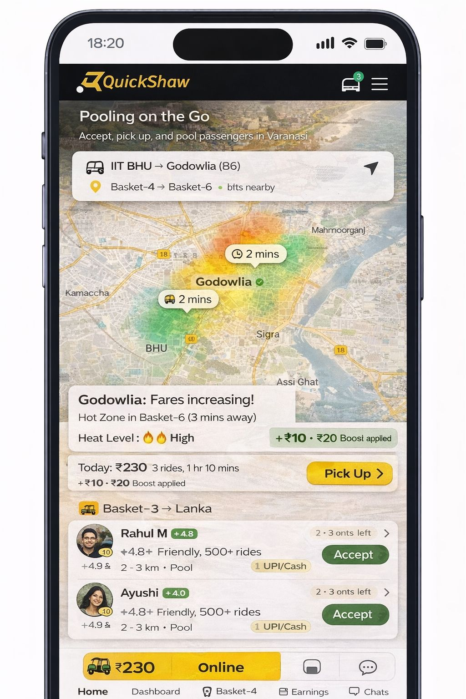

# QuickShaw

QuickShaw is a basket-based pooled mobility platform designed for short-distance travel in Tier-2 and Tier-3 cities.

The system focuses on rickshaws and e-autos, enabling efficient real-time pooling for both passengers and drivers in high-frequency, low-distance urban mobility scenarios.

---

## Contribution Notice

This repository documents my contribution work on **UI structure, product-level documentation, and visual assets**.  
The original concept and core backend implementation belong to the project owner.

My focus areas in this repository include:
- Interface structure and clarity
- Product positioning and documentation
- Visual asset organization and usage

---

## Two-Sided Platform

QuickShaw is designed as a two-sided system, addressing the distinct needs of both riders and drivers:

- **User App**  
  Designed for passengers booking short pooled rides with minimal friction and fast decision-making.

- **Driver App**  
  Built for rickshaw and e-auto drivers to manage pooled trips, demand visibility, and operational flow.

  ## Documentation

- [Problem & Business Model](docs/problem-and-model.md)
- [Pooling Logic (Stage-1 MVP)](docs/pooling-logic.md)
- [User vs Driver View](docs/user-vs-driver.md)

  ## Repo Structure

- `public/` → UI mockups (user + driver)
- `docs/` → product logic and system notes

---

## User App Interface

The user interface prioritizes simplicity and speed, allowing passengers to quickly book short-distance pooled rides without relying on complex maps or fare structures.

The experience is optimized for frequent, everyday usage rather than occasional long-distance trips.


---

## Driver App Interface

The driver interface focuses on operational efficiency by exposing pooling logic, demand heat zones, and real-time rider requests.

It is designed to support high-frequency decision-making in dense urban environments.



---

## Product Positioning

QuickShaw targets short-distance pooled mobility use cases in Tier-2 and Tier-3 cities, where high-cost, cab-oriented platforms are not practical for daily commuting.

The platform prioritizes:
- Affordability
- High-frequency usage
- Driver-first economics  

over commission-heavy, long-distance ride-hailing models.

---

## Development Setup

This is a Next.js project bootstrapped with `create-next-app`.

```bash
npm run dev


## Future Scope (Stage-2)

The following capabilities are intentionally scoped for post-MVP iterations.
Stage-2 focuses on optimization and scalability once core pooling behavior
and driver adoption are validated.

Planned areas of expansion include:

- **Weighted pooling metrics**  
  Pooling decisions that consider user waiting tolerance and driver idle time,
  rather than fixed thresholds.

- **Dynamic fare adjustments**  
  Introduction of waiting fees, cancellation penalties, and incentive balancing
  to improve reliability without reverting to commission-based pricing.

- **“Pool on the Go” matching**  
  Direction-based pooling that allows riders to be matched while vehicles
  are already in motion, increasing utilization during peak hours.

- **Expanded demand intelligence**  
  More granular heatmap signals to support driver decision-making across
  time-of-day and location patterns.

- **Scalable location architecture**  
  Transition from region-specific configuration to a scalable location
  database supporting multi-city expansion.

These enhancements are deferred to Stage-2 to preserve MVP simplicity
and reduce operational risk during early deployment.


## Project Scope & Disclaimer

This project is a **product and system design case study** rather than a full production implementation.

It focuses on:
- Product thinking and UX-driven decisions
- Rule-based pooling logic and matching constraints
- Asymmetric information design between users and drivers

It intentionally excludes:
- Backend implementation details
- Real-time APIs or live data integrations
- Production-scale performance optimization

The primary goal of this project is to demonstrate **system-level thinking,
scope control, and product-oriented decision-making**,
not to deliver a fully engineered application.


